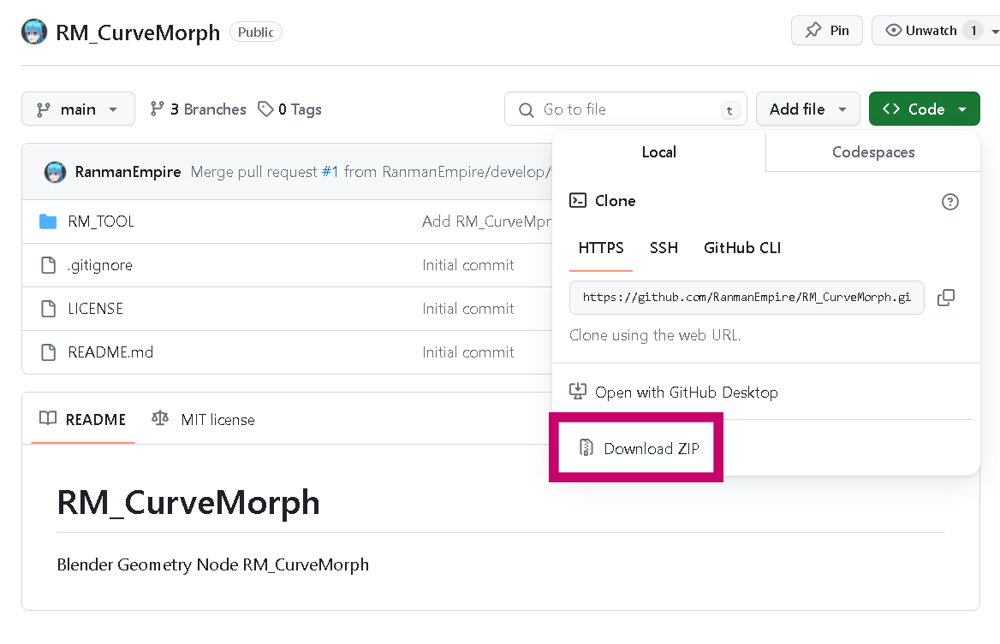

# RM_CurveMorph
- **RM_CurveMorph**は3DCGソフトBlenderのジオメトリーノード製のツールです。カーブオブジェクトにモディファイヤとして適用し、指定したオブジェクトをカーブに沿って変形します。

### アセットライブラリへの登録方法
- **RM_CurveMorph**はBlenderのジオメトリーノード製です。そのためアセットライブラリに登録して使用するといいでしょう。

- GithubのRM_CurveMorphのページからzipファイルをダウンロードし、解凍します

- Blenderの【プリファレンス】→【ファイルパス】→【アセットライブラリ】を開いてください。アセットライブラリとして使用できるフォルダパスが確認できます。このフォルダパスに先ほど解凍した中から「RM_TOOL」フォルダをコピーします。
  
  

- Blenderを再起動してアセットライブラリを表示するとRM_TOOLの項目があり、その中にRM_CurveMorphのほかサンプル用のメッシュが入っていればアセットライブラリへの登録は成功です。
  

### 使用方法
- アセットライブラリへの登録が済んでいれば、カーブオブジェクトのモディファイアの一覧の中にRM_CurveMorphが表示されているので、モディファイアとして選択してください。
  

### 設定項目
- RM_CurveMorphの設定項目と効果は次になります

|項目|効果|
|---|---|
|Source Mesh|変形するメッシュオブジェクトを指定します|
|Source Mesh Rotation X・Y・Z|変形前にメッシュオブジェクトを回転します 先の画像のように-Zを向くオブジェクトはX 90°, Y 0°, Z -90° にすると良いでしょう|
|Source Mesh Position LR・UD|カーブの軸に対してメッシュオブジェクトの位置を左右上下方向に移動します|
|Curve Start・End|カーブの長さを変更します|
|-x**2・Linear・1-x\*\*2|メッシュの中央が山となるように変形します|
|Material Change|マテリアルを変更するか選択します|
|Material|Material Changeにチェックを入れた場合、ここで指定したマテリアルが適用されます|
|UV Map Name|ここで名前指定したUVマップの位置を変更することができます 初期値は"UVMap"です|
|UV Slide U・V|UV Map Nameで名前指定したUVマップの位置をずらします|

### 注意事項
- メッシュの適用問題(Blender4.0で確認)
  - 問題
    - おそらくRM_CurveMorphを使う全員が直面します
    - RM_CurveMorphで作成したオブジェクトを適用する際にエラーが起こります
    - RM_CurveMorphはカーブオブジェクトからメッシュデータを作るものですが、Blender内の処理では外見上はカーブオブジェクトのままです。そのためカーブオブジェクトの中にメッシュデータがあり、通常の変換処理ができずエラーとなっていると予想されます
    - 
  - 解決方法
    - メニューの「オブジェクト」→「変換」→「メッシュ」を選択するとメッシュへ変換されます
    - 

### バグ報告・機能追加要望についてのお願い
- 使用中にバグを発見した際・追加機能の要望があればぜひ作者までご連絡ください。それぞれご対応いたします。

### 免責事項
- 本ツールは、使用者の責任にて使用することを前提として提供されます。本ツールの妥当性や結果に関する判断は使用者が行うべきものであり、著作権者は使用結果に関して何らの保証をするものではなく、どのような形でも責任を負いません。著作権者は本ツールの仕様、もしくは使用不能に起因して生じた利益の損失、障害、その他の金銭的な損害を含め、いかなる特定の偶発的、間接的、もしくは派生的損害についても責任を負いません。